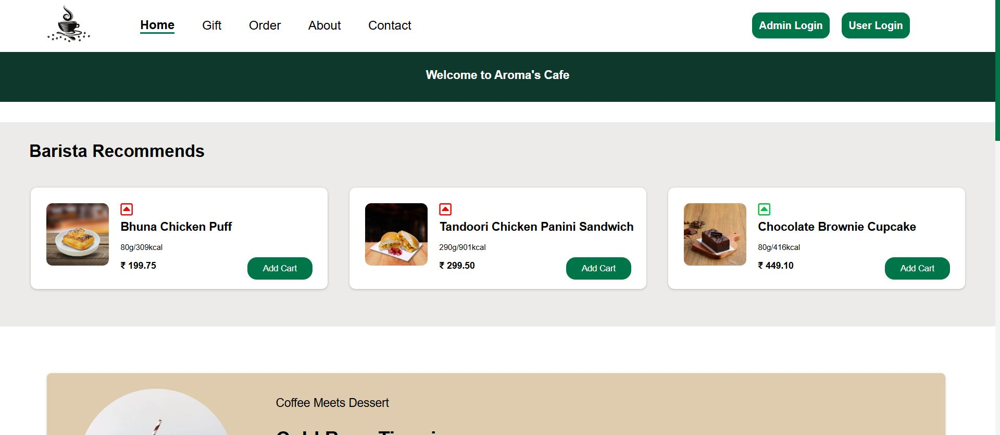
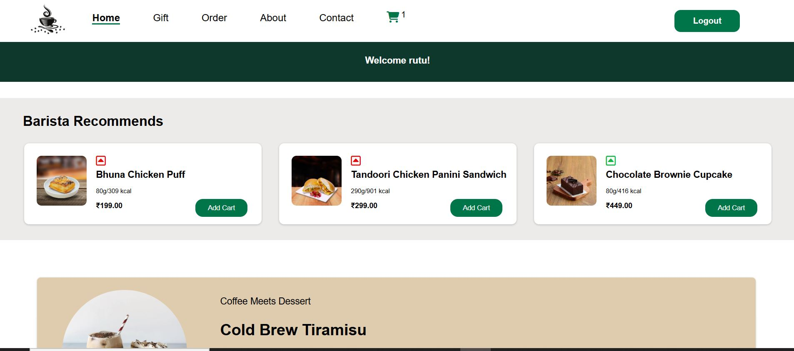
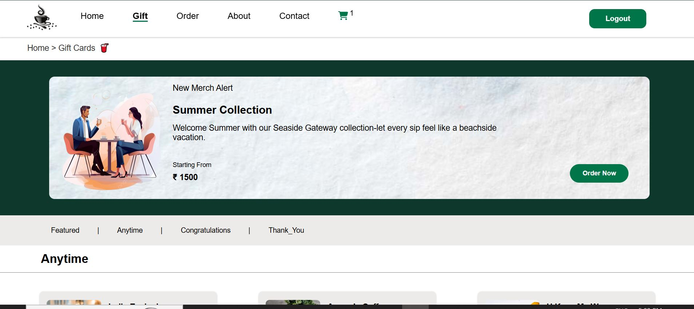
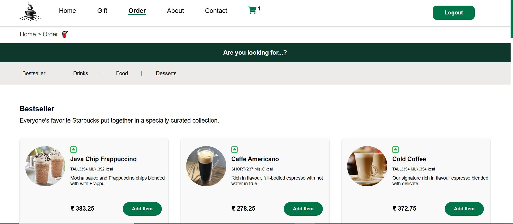
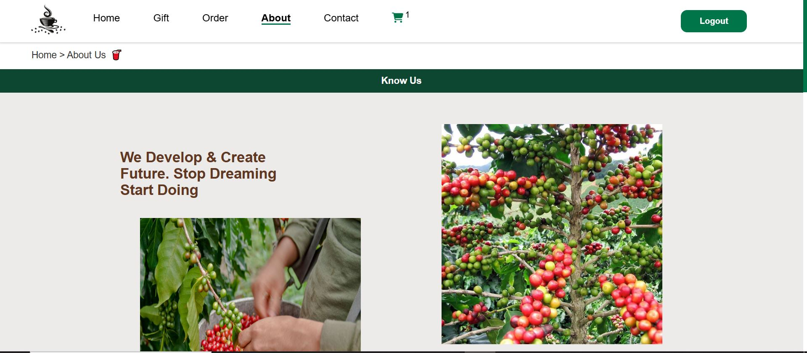
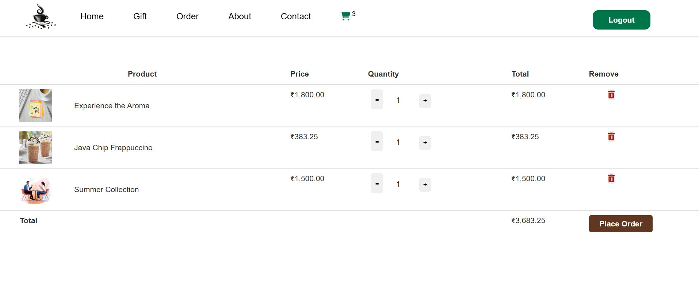
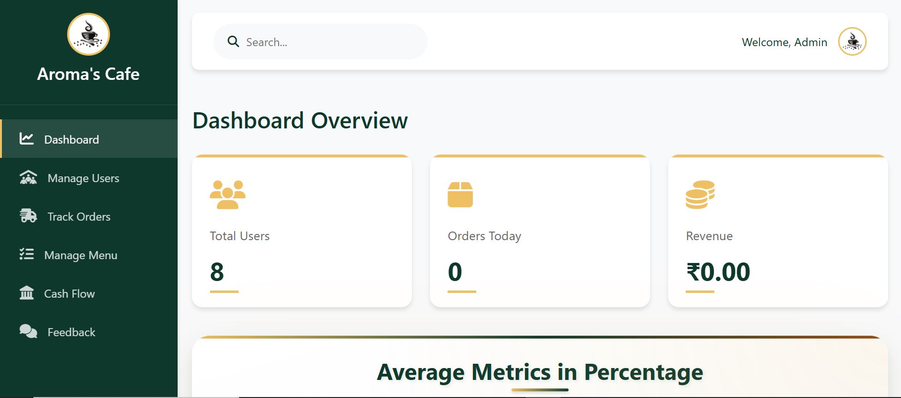
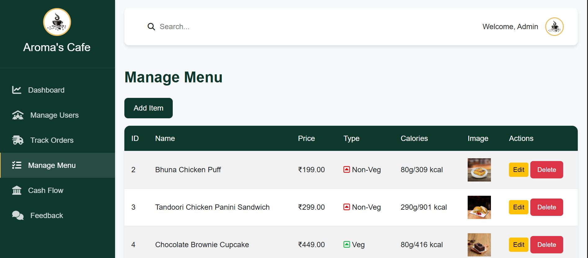

# ☕ Aroma's Cafe  

Aroma's Cafe is a **web-based café management and ordering system** designed to provide users with a seamless experience of browsing menus, placing orders, and managing cart items online. Built using **PHP, MySQL, HTML, CSS, and JavaScript**, this project demonstrates a complete full-stack application with both frontend and backend integration.  

---

## 🚀 Features  
- 🍴 Interactive Menu with categories (Coffee, Beverages, Snacks, Desserts)  
- 🛒 Add to Cart & Update Quantities  
- 💳 Checkout System for order placement  
- 👩‍💻 Admin Panel for product & order management  
- 📱 Responsive design for mobile and desktop  
- 🔐 User authentication (Login / Register)  

---

## 🛠️ Tech Stack  
- **Frontend:** HTML5, CSS3, JavaScript  
- **Backend:** PHP Oop (XAMPP)  
- **Database:** MySQL  
- **Version Control:** Git & GitHub  

---

## Landing Page

## Home Page

## Gift Page

## Order Page

## About Page

## Cart Page

## Admin Dashboard Page

## Admin Menu Management Page

